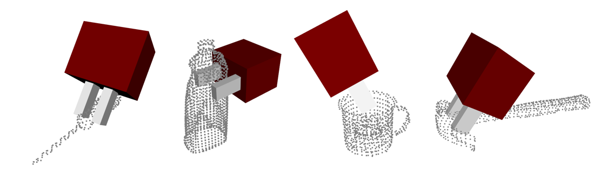

# Model-free & Learning-free robotic grasping

## About

GraspLoCoMo is a C++ software package used for robotic grasp generation. It allows to generate grasps for parallel jaw-grippers given a 3D point cloud with normals. This implementation is based on the results from the publication [Model-free and learning-free grasping by Local Contact Moment matching](https://core.ac.uk/download/pdf/267309469.pdf). 


_**Note:** The visualizer is not included in this release_

**Authors**
* [Maxime Adjigble](https://www.linkedin.com/in/maxime-adjigble/)
* [Naresh Marturi](https://www.linkedin.com/in/nareshmarturi/)

**Citation**
If you use GraspLoCoMo in your work, please cite our [IROS'18 paper](https://ieeexplore.ieee.org/document/8594226):
```
@inproceedings{adjigble2018model,
  title={Model-free and learning-free grasping by local contact moment matching},
  author={Adjigble, Maxime and Marturi, Naresh and Ortenzi, Valerio and Rajasekaran, Vijaykumar and Corke, Peter and Stolkin, Rustam},
  booktitle={2018 IEEE/RSJ International Conference on Intelligent Robots and Systems (IROS)},
  pages={2933--2940},
  year={2018},
  organization={IEEE}
}
```

## Installation

### Software Requirements
GraspLoCoMo requires the following software:

* [Visual Studio](https://visualstudio.microsoft.com/)
* [CMake](https://cmake.org/)
  
and the following mandatory libraries
* [Eigen](http://eigen.tuxfamily.org/)
* [Nanoflann](https://github.com/jlblancoc/nanoflann)

**Note** Eigen and Nanoflann are headers-only libraries and can be easily integrated using CMake. Please, download the requirements from each link and follow the instructions below the compile the code.

**Windows:** 
Install Visual Studio and CMake. Clone/Download Eigen and Nanoflann in the **_ThirdParty_** folder. 
In the CMakeLists.txt file, change the value of the variables _EIGEN3_INCLUDE_ and _NANO_FLANN_INCLUDE_ to the path of Eigen and Nanoflann.
Open CMake and configure the project.

```
**Where is the source code** : <Location of GraspLoCoMo>
**Where to build the binaries** : <Location of GraspLoCoMo>/Build	
```
Click on **Configure** and use the following configuration.

```
**Specify the generator for this project** : <Your installed version of visual studio>	
**Optional platform for generator ...** : x64
```
Click on **Finish**. The project can now be generated by clicking on **Generate**. 
The _Build_ folder will contain the Visual Studio solution of the project (GraspLoCoMo.sln).
Open the solution using Visual Studio and set the **TestdxGraspLoCoMo** as StartUp Project. Select **Release**, **x64** if not already set. And click run to execute the code.

**_Note (Release mode):_** By default the project will be in Debug mode. For some reason the execution of the code is much slower in this mode, set the poject to Release to get better performances. This will be fixed in future!!

**_Note for Linux:_** The code has not been tested on Linux, but should work with minor changes. The above procedure still applies.

### Folder Structure
- Grasp: LoCoMo Grasping code
  - include: Folder containing the include files
  - src: Folder containing the source files of the method
  - test: Code that can be used to test the method
- Clouds: Example point clouds
- Core: Utility modules and functions
- ThirdParty: Empty folder where the required libraries are installed

## License

BSD 3 - Clause License

Copyright(c) 2021, Maxime Adjigble 
All rights reserved.

Redistribution and use in source and binary forms, with or without
modification, are permitted provided that the following conditions are met :

1. Redistributions of source code must retain the above copyright notice, this
list of conditions and the following disclaimer.

2. Redistributions in binary form must reproduce the above copyright notice,
this list of conditions and the following disclaimer in the documentation
and/or other materials provided with the distribution.

3. Neither the name of the copyright holder nor the names of its
contributors may be used to endorse or promote products derived from
this software without specific prior written permission.

THIS SOFTWARE IS PROVIDED BY THE COPYRIGHT HOLDERS AND CONTRIBUTORS "AS IS"
AND ANY EXPRESS OR IMPLIED WARRANTIES, INCLUDING, BUT NOT LIMITED TO, THE
IMPLIED WARRANTIES OF MERCHANTABILITY AND FITNESS FOR A PARTICULAR PURPOSE ARE
DISCLAIMED.IN NO EVENT SHALL THE COPYRIGHT HOLDER OR CONTRIBUTORS BE LIABLE
FOR ANY DIRECT, INDIRECT, INCIDENTAL, SPECIAL, EXEMPLARY, OR CONSEQUENTIAL
DAMAGES(INCLUDING, BUT NOT LIMITED TO, PROCUREMENT OF SUBSTITUTE GOODS OR
SERVICES; LOSS OF USE, DATA, OR PROFITS; OR BUSINESS INTERRUPTION) HOWEVER
CAUSED AND ON ANY THEORY OF LIABILITY, WHETHER IN CONTRACT, STRICT LIABILITY,
OR TORT(INCLUDING NEGLIGENCE OR OTHERWISE) ARISING IN ANY WAY OUT OF THE USE
OF THIS SOFTWARE, EVEN IF ADVISED OF THE POSSIBILITY OF SUCH DAMAGE.


**For details, Contact us @**
* Maxime: m.k.j.adjigble@bham.ac.uk
* Naresh: n.marturi@bham.ac.uk
